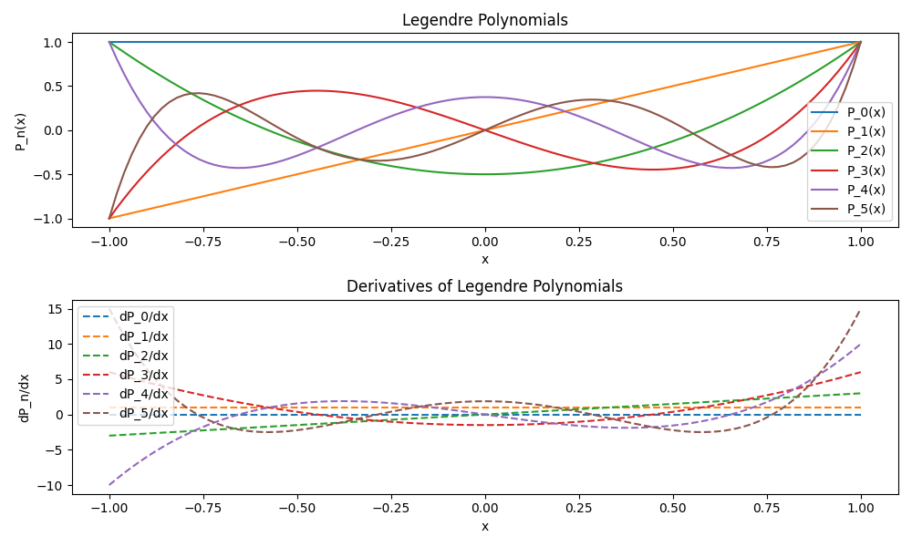

# Welcome to ASC-ODE's documentation!

ASC-ODE is a C++ library for solving ordinary differential equations (ODEs). It provides various time-stepping methods that work with user-defined right-hand-side functions.

This documentation covers:
1. **Build instructions** — how to compile the library and demos
2. **Mass-spring system** — comparing Euler, Improved Euler, and Crank-Nicolson methods
3. **RC circuit** — stability analysis with different step sizes
4. **Runge-Kutta methods** — convergence tests for RK2 and RK4
5. **AutoDiff** — automatic differentiation for Jacobians
6. **Legendre polynomials** — testing AutoDiff with polynomial derivatives
7. **Mechanical systems** — pendulum mass-spring system with distance constraints

**References:**
- [Introduction to Scientific Computing](https://jschoeberl.github.io/IntroSC/intro.html)
- [ODE Theory](https://jschoeberl.github.io/IntroSC/ODEs/ODEs.html)
- [Basic Linear Algebra (BLA) Documentation](https://jschoeberl.github.io/IntroSC/basiclinalg/bla-docu.html)

---

## Installation

Install ASC-ODE via git-clone:

```bash
git clone https://github.com/hcfalkow/ASC-ODE-team08.git
```

To configure and build:

```bash
cd ASC-ODE-team08
mkdir build
cd build
cmake ..
make
```

If `pybind11` is missing for the Python bindings, install it with:
```bash
pip install pybind11
```

---

## Mass-Spring System (Exercise 17.2.2)

The mass-spring system is modeled as a first-order ODE:

$$\begin{aligned}
y_0' &= y_1 \\
y_1' &= -\frac{k}{m} y_0
\end{aligned}$$

With $m = k = 1$, the exact solution is $y_0(t) = \cos(t)$, $y_1(t) = -\sin(t)$.

### C++ Implementation

```cpp
class MassSpring : public NonlinearFunction {
  double mass, stiffness;
public:
  MassSpring(double m, double k) : mass(m), stiffness(k) {}
  size_t dimX() const override { return 2; }
  size_t dimF() const override { return 2; }
  
  void evaluate(VectorView<double> x, VectorView<double> f) const override {
    f(0) = x(1);
    f(1) = -stiffness/mass * x(0);
  }
  
  void evaluateDeriv(VectorView<double> x, MatrixView<double> df) const override {
    df = 0.0;
    df(0,1) = 1;
    df(1,0) = -stiffness/mass;
  }
};
```

### Results: Comparing Methods

The mass-spring system has no damping, so it should oscillate forever. Let's see how different methods behave.

#### Explicit Euler (1000 steps)

The explicit Euler method is unstable for oscillatory systems — energy grows over time.


*Figure 1: Explicit Euler — position diverges over time*


*Figure 2: Explicit Euler — phase space spiral outward (energy grows)*

#### Implicit Euler (1000 steps)

The implicit Euler method is stable but adds artificial damping — energy shrinks over time.


*Figure 3: Implicit Euler — amplitude decreases*


*Figure 4: Implicit Euler — phase space spiral inward (energy lost)*

#### Improved Euler (1000 steps)

The improved Euler (midpoint) method is second-order accurate and preserves energy much better.


*Figure 5: Improved Euler — stable oscillation*


*Figure 6: Improved Euler — nearly circular phase trajectory*

#### Explicit Euler with Many Steps (100,000 steps)

With enough steps, even explicit Euler can track the solution:


*Figure 7: Explicit Euler with 100,000 steps — much better accuracy*


*Figure 8: Explicit Euler with 100,000 steps — phase space nearly circular*

---

## Crank-Nicolson Method (Exercise 17.4.1)

The Crank-Nicolson method averages explicit and implicit Euler:

$$y_{n+1} = y_n + \frac{\tau}{2}\big(f(t_n, y_n) + f(t_{n+1}, y_{n+1})\big)$$

This is second-order accurate and preserves energy for Hamiltonian systems.

### C++ Implementation

```cpp
class CrankNicolson : public TimeStepper {
  std::shared_ptr<NonlinearFunction> m_equ;
  std::shared_ptr<Parameter> m_tau;
  std::shared_ptr<ConstantFunction> m_yold, m_fold;
public:
  CrankNicolson(std::shared_ptr<NonlinearFunction> rhs)
    : TimeStepper(rhs), m_tau(std::make_shared<Parameter>(0.0)) {
    m_yold = std::make_shared<ConstantFunction>(rhs->dimX());
    auto ynew = std::make_shared<IdentityFunction>(rhs->dimX());
    m_fold = std::make_shared<ConstantFunction>(rhs->dimF());
    m_equ = ynew - m_yold - m_tau * (m_rhs + m_fold);
  }
  void DoStep(double tau, VectorView<double> y) override {
    m_yold->set(y);
    m_rhs->evaluate(y, m_fold->get());
    m_tau->set(tau/2.0);
    NewtonSolver(m_equ, y);
  }
};
```

### Results: Only 100 steps needed!


*Figure 9: Crank-Nicolson with just 100 steps — excellent accuracy*


*Figure 10: Crank-Nicolson — perfect circle in phase space*

**Key insight:** Crank-Nicolson needs far fewer steps than Euler methods for the same accuracy.

---

## RC Circuit — Stability Analysis

The RC circuit models a capacitor charging through a resistor:

$$\frac{dU_C}{dt} = \frac{U_0 - U_C}{RC}$$

where $U_0 = \cos(\omega t)$ with $\omega = 100\pi$.

This is a *non-autonomous* ODE (depends on $t$ explicitly). We make it autonomous by adding $t$ as a state variable.

### C++ Implementation

```cpp
class RCCircuit : public NonlinearFunction {
  double resistance, capacitance, omega;
public:
  RCCircuit(double R, double C, double w)
    : resistance(R), capacitance(C), omega(w) {}
  
  size_t dimX() const override { return 2; }  // [U_C, t]
  size_t dimF() const override { return 2; }
  
  void evaluate(VectorView<double> x, VectorView<double> f) const override {
    f(0) = (cos(omega * x(1)) - x(0)) / (resistance * capacitance);
    f(1) = 1.0;  // dt/dt = 1
  }
  
  void evaluateDeriv(VectorView<double> x, MatrixView<double> df) const override {
    df = 0.0;
    df(0,0) = -1.0 / (resistance * capacitance);
    df(0,1) = -omega * sin(omega * x(1)) / (resistance * capacitance);
    df(1,1) = 0.0;
  }
};
```

### Results with 500 steps


*Figure 11: Explicit Euler — unstable at 500 steps*


*Figure 12: Implicit Euler — stable at 500 steps*


*Figure 13: Crank-Nicolson — stable and accurate at 500 steps*

### Results with 2000 steps


*Figure 14: Explicit Euler — now stable with 2000 steps*


*Figure 15: Implicit Euler — still stable*


*Figure 16: Crank-Nicolson — excellent accuracy*

**Key insight:** Explicit Euler needs many more steps than implicit methods for stiff problems.

---

## Available Time-Stepping Methods

### Explicit Euler

```cpp
class ExplicitEuler : public TimeStepper {
  Vector<> m_vecf;
public:
  ExplicitEuler(std::shared_ptr<NonlinearFunction> rhs) 
    : TimeStepper(rhs), m_vecf(rhs->dimF()) {}
  void DoStep(double tau, VectorView<double> y) override {
    this->m_rhs->evaluate(y, m_vecf);
    y += tau * m_vecf;
  }
};
```

### Implicit Euler

```cpp
class ImplicitEuler : public TimeStepper {
  std::shared_ptr<NonlinearFunction> m_equ;
  std::shared_ptr<Parameter> m_tau;
  std::shared_ptr<ConstantFunction> m_yold;
public:
  ImplicitEuler(std::shared_ptr<NonlinearFunction> rhs)
    : TimeStepper(rhs), m_tau(std::make_shared<Parameter>(0.0)) {
    m_yold = std::make_shared<ConstantFunction>(rhs->dimX());
    auto ynew = std::make_shared<IdentityFunction>(rhs->dimX());
    m_equ = ynew - m_yold - m_tau * m_rhs;
  }
  void DoStep(double tau, VectorView<double> y) override {
    m_yold->set(y);
    m_tau->set(tau);
    NewtonSolver(m_equ, y);
  }
};
```

### Improved Euler

```cpp
class ImprovedEuler : public TimeStepper {
  Vector<> m_vecf;
  Vector<> m_ytilde;
public:
  ImprovedEuler(std::shared_ptr<NonlinearFunction> rhs) 
    : TimeStepper(rhs), m_vecf(rhs->dimF()), m_ytilde(rhs->dimX()) {}
  void DoStep(double tau, VectorView<double> y) override {
    this->m_rhs->evaluate(y, m_vecf);
    m_ytilde = y + (tau/2.0) * m_vecf;
    this->m_rhs->evaluate(m_ytilde, m_vecf);
    y += tau * m_vecf;
  }
};
```

---

## Runge-Kutta Methods (Exercise 19)

Higher-order methods achieve better accuracy with fewer steps. The key idea is to evaluate the right-hand side at multiple points within each step.

### Butcher Tableau

An s-stage Runge-Kutta method is defined by coefficients $(a, b, c)$:

$$k^j = f\Big(y_n + \tau \sum_{\ell < j} a_{j\ell} k^\ell\Big), \quad
y_{n+1} = y_n + \tau \sum_j b_j k^j$$

For **explicit** methods, $a$ is strictly lower triangular.

### C++ Implementation

```cpp
class ExplicitRungeKutta : public TimeStepper {
  Matrix<> m_a;
  Vector<> m_b, m_c;
  int m_stages, m_n;
  Vector<> m_k, m_ytmp;
public:
  ExplicitRungeKutta(std::shared_ptr<NonlinearFunction> rhs,
                     const Matrix<>& a, const Vector<>& b, const Vector<>& c)
    : TimeStepper(rhs), m_a(a), m_b(b), m_c(c),
      m_stages(c.size()), m_n(rhs->dimX()),
      m_k(m_stages * m_n), m_ytmp(m_n) {}
  
  void DoStep(double tau, VectorView<double> y) override {
    m_k = 0.0;
    for (int j = 0; j < m_stages; j++) {
      m_ytmp = y;
      for (int l = 0; l < j; l++)
        m_ytmp += tau * m_a(j,l) * m_k.range(l*m_n, (l+1)*m_n);
      m_rhs->evaluate(m_ytmp, m_k.range(j*m_n, (j+1)*m_n));
    }
    for (int j = 0; j < m_stages; j++)
      y += tau * m_b(j) * m_k.range(j*m_n, (j+1)*m_n);
  }
};
```

### Butcher Tableaus

**RK2 (midpoint):**
```cpp
Matrix<double> RK2a { { 0.0, 0.0 }, { 0.5, 0.0 } };
Vector<> RK2b { 0.0, 1.0 };
Vector<> RK2c { 0.0, 0.5 };
```

**Classical RK4:**
```cpp
Matrix<double> RK4a { 
  { 0.0, 0.0, 0.0, 0.0 },
  { 0.5, 0.0, 0.0, 0.0 },
  { 0.0, 0.5, 0.0, 0.0 },
  { 0.0, 0.0, 1.0, 0.0 }
};
Vector<> RK4b { 1.0/6.0, 1.0/3.0, 1.0/3.0, 1.0/6.0 };
Vector<> RK4c { 0.0, 0.5, 0.5, 1.0 };
```

### Convergence Results

**RK2 (2nd order):**

| Steps | Error x      | Ratio |
|-------|--------------|-------|
| 100   | 1.86e-04     | -     |
| 200   | 2.38e-05     | ~7.8  |
| 400   | 3.01e-06     | ~7.9  |
| 800   | 3.78e-07     | ~8.0  |

Error reduces by ~4× when doubling steps (expected for 2nd order: $2^2 = 4$)

**RK4 (4th order):**

| Steps | Error x      | Ratio |
|-------|--------------|-------|
| 50    | 1.36e-06     | -     |
| 100   | 4.27e-08     | ~32   |
| 200   | 1.34e-09     | ~32   |
| 400   | 4.17e-11     | ~32   |

Error reduces by ~16× when doubling steps (expected for 4th order: $2^4 = 16$)

**Comparison: Explicit vs Implicit (200 steps)**

| Method          | Error x     | Error v     |
|-----------------|-------------|-------------|
| Explicit RK4    | 1.34e-09    | 5.10e-08    |
| Implicit Gauss3 | ~0          | 6.11e-14    |

The implicit method (6th order Gauss-Legendre) achieves much better accuracy.

---

## AutoDiff — Automatic Differentiation (Exercise 18.4)

Computing Jacobians by hand is error-prone. **Automatic differentiation** computes exact derivatives by tracking how operations propagate through a computation.

### Core Idea

An `AutoDiff<N>` object stores both the value and its $N$ partial derivatives:

```cpp
template <size_t N, typename T = double>
class AutoDiff {
  T m_val;
  std::array<T, N> m_deriv;
public:
  AutoDiff() : m_val(0), m_deriv{} {}
  AutoDiff(T v) : m_val(v), m_deriv{} {
    for (size_t i = 0; i < N; i++)
      m_deriv[i] = derivative(v, i);
  }
  
  template <size_t I>
  AutoDiff(Variable<I, T> var) : m_val(var.value()), m_deriv{} {
    m_deriv[I] = 1.0;
  }

  T value() const { return m_val; }
  std::array<T, N>& deriv() { return m_deriv; }
  const std::array<T, N>& deriv() const { return m_deriv; }
};
```

### Operator Overloads

Each operation propagates derivatives using the chain rule:

```cpp
// Addition: (a+b)' = a' + b'
template <size_t N, typename T = double>
AutoDiff<N, T> operator+(const AutoDiff<N, T>& a, const AutoDiff<N, T>& b) {
  AutoDiff<N, T> result(a.value() + b.value());
  for (size_t i = 0; i < N; i++)
    result.deriv()[i] = a.deriv()[i] + b.deriv()[i];
  return result;
}

// Subtraction: (a-b)' = a' - b'
template <size_t N, typename T = double>
AutoDiff<N, T> operator-(const AutoDiff<N, T>& a, const AutoDiff<N, T>& b) {
  AutoDiff<N, T> result(a.value() - b.value());
  for (size_t i = 0; i < N; i++)
    result.deriv()[i] = a.deriv()[i] - b.deriv()[i];
  return result;
}

// Multiplication: (a*b)' = a'*b + a*b'
template <size_t N, typename T = double>
AutoDiff<N, T> operator*(const AutoDiff<N, T>& a, const AutoDiff<N, T>& b) {
  AutoDiff<N, T> result(a.value() * b.value());
  for (size_t i = 0; i < N; i++)
    result.deriv()[i] = a.deriv()[i] * b.value() + a.value() * b.deriv()[i];
  return result;
}

// Division: (a/b)' = (a'*b - a*b') / b^2
template <size_t N, typename T = double>
AutoDiff<N, T> operator/(const AutoDiff<N, T>& a, const AutoDiff<N, T>& b) {
  AutoDiff<N, T> result(a.value() / b.value());
  for (size_t i = 0; i < N; i++)
    result.deriv()[i] = (a.deriv()[i] * b.value() - a.value() * b.deriv()[i]) 
                        / (b.value() * b.value());
  return result;
}
```

### Math Functions

Standard functions are overloaded too:

```cpp
// sin: d/dx sin(a) = cos(a) * a'
template <size_t N, typename T = double>
AutoDiff<N, T> sin(const AutoDiff<N, T>& a) {
  AutoDiff<N, T> result(sin(a.value()));
  for (size_t i = 0; i < N; i++)
    result.deriv()[i] = cos(a.value()) * a.deriv()[i];
  return result;
}

// cos: d/dx cos(a) = -sin(a) * a'
template <size_t N, typename T = double>
AutoDiff<N, T> cos(const AutoDiff<N, T>& a) {
  AutoDiff<N, T> result(cos(a.value()));
  for (size_t i = 0; i < N; i++)
    result.deriv()[i] = -sin(a.value()) * a.deriv()[i];
  return result;
}

// exp: d/dx exp(a) = exp(a) * a'
template <size_t N, typename T = double>
AutoDiff<N, T> exp(const AutoDiff<N, T>& a) {
  AutoDiff<N, T> result(exp(a.value()));
  for (size_t i = 0; i < N; i++)
    result.deriv()[i] = exp(a.value()) * a.deriv()[i];
  return result;
}

// log: d/dx log(a) = a' / a
template <size_t N, typename T = double>
AutoDiff<N, T> log(const AutoDiff<N, T>& a) {
  AutoDiff<N, T> result(log(a.value()));
  for (size_t i = 0; i < N; i++)
    result.deriv()[i] = (1 / a.value()) * a.deriv()[i];
  return result;
}

// pow: d/dx a^n = n * a^(n-1) * a'
template <size_t N, typename T = double>
AutoDiff<N, T> pow(const AutoDiff<N, T>& a, T n) {
  AutoDiff<N, T> result(pow(a.value(), n));
  for (size_t i = 0; i < N; i++)
    result.deriv()[i] = n * pow(a.value(), n - 1) * a.deriv()[i];
  return result;
}

// sqrt: d/dx sqrt(a) = a' / (2 * sqrt(a))
template <size_t N, typename T = double>
AutoDiff<N, T> sqrt(const AutoDiff<N, T>& a) {
  AutoDiff<N, T> result(sqrt(a.value()));
  for (size_t i = 0; i < N; i++)
    result.deriv()[i] = (1 / (2 * sqrt(a.value()))) * a.deriv()[i];
  return result;
}
```

---

## Using AutoDiff for ODEs (Exercise 18.5)

The pendulum ODE requires a Jacobian for implicit methods. Instead of deriving it by hand, we use a **templated evaluate function**:

```cpp
template <typename T>
void T_evaluate(VectorView<T> x, VectorView<T> f) const {
  f(0) = x(1);
  f(1) = -m_gravity/m_length * sin(x(0));
}
```

- Call with `T = double` → get function values
- Call with `T = AutoDiff<2>` → get values AND Jacobian

The evaluate function calls the template with double:
```cpp
void evaluate(VectorView<double> x, VectorView<double> f) const override {
    T_evaluate<double>(x, f);
}
```

The evaluateDeriv function constructs AutoDiff variables:
```cpp
void evaluateDeriv(VectorView<double> x, MatrixView<double> df) const override {
    VectorView<AutoDiff<2>> x_ad(2), f_ad(2);
    x_ad(0) = Variable<0>(x(0));
    x_ad(1) = Variable<1>(x(1));
    T_evaluate<AutoDiff<2>>(x_ad, f_ad);
    // Extract Jacobian from AutoDiff derivatives
    for (size_t i = 0; i < 2; i++)
        for (size_t j = 0; j < 2; j++)
            df(i, j) = f_ad(i).deriv()[j];
}
```

This ensures the Jacobian is always consistent with the function.

### Testing

A test program compares:
- The function value evaluated with doubles
- The automatically computed Jacobian
- The analytically derived Jacobian

The test verifies that AutoDiff produces the correct derivative structure, and the numerical values match the analytical Jacobian up to machine precision.

---

## Legendre Polynomials — AutoDiff Test

Legendre polynomials $P_n(x)$ satisfy a recurrence relation:

$$P_0(x) = 1, \quad P_1(x) = x, \quad
P_n(x) = \frac{(2n-1)x P_{n-1}(x) - (n-1)P_{n-2}(x)}{n}$$

### C++ Implementation

```cpp
template <typename T>
void LegendrePolynomials(int n, T x, std::vector<T>& P) {
    if (n < 0) {
        P.clear();
        return;
    }
    P.resize(n + 1);
    P[0] = T(1);
    if (n == 0) return;
    P[1] = x;
    for (int k = 2; k <= n; ++k) {
        P[k] = ((T(2 * k - 1) * x * P[k - 1]) - T(k - 1) * P[k - 2]) / T(k);
    }
}
```

When called with `AutoDiff`, we get both $P_n(x)$ and $P_n'(x)$ automatically!


*Figure 17: Legendre polynomials and their derivatives up to order 5*

---

## Exercise 20: Mechanical Systems

To simulate the pendulum mass-spring system, the *Newmark* branch from ASC-ODE was merged into the main branch of this repository. The C++ implementation of the mass spring system can be found in the *mass_spring.hpp* header file in the *mechsystem* folder. This header file allows for the user to configure an arbitrary setup of system with a configurable number of masses, spring connections and fixtures and afterwards describe the system dynamics by differential equations.

- **mass_spring.cpp** solves a specific system configuration and outputs *test_pendulum* which can be run to obtain the simulation results.
- **bind_mass_spring.cpp** uses **pybind11** to bind the C++ implementation into a Python implementation that can be simulated in either the python file *test_mass_spring.py* or in the *jupyter notebook*, *mass_spring.ipynb* where a 3D simulation of the system can be viewed.

For instance, a system consisting of 3 masses, connected in a chain together, with the first mass connected to a fixed point:

```python
mss = MassSpringSystem3d()
mss.gravity = (0,0,-9.81)

mA = mss.add (Mass(1, (1,0,0)))
mB = mss.add (Mass(2, (2,0,0)))
mC = mss.add (Mass(1, (3,0,0)))
f1 = mss.add (Fix( (0,0,0)) )
mss.add (Spring(1, 200000, (f1, mA)))
mss.add (Spring(1, 100000, (mA, mB)))
mss.add (Spring(1, 200000, (mB, mC)))
```

The 3D visualization is then set up:

```python
masses = []
for m in mss.masses:
    masses.append(
        Mesh(SphereBufferGeometry(0.2, 16, 16),
             MeshStandardMaterial(color='red'),
             position=m.pos)) 

fixes = []
for f in mss.fixes:
    fixes.append(
        Mesh(SphereBufferGeometry(0.2, 32, 16),
             MeshStandardMaterial(color='blue'),
             position=f.pos)) 

springpos = []
for s in mss.springs:
    pA = mss[s.connectors[0]].pos
    pB = mss[s.connectors[1]].pos
    springpos.append ([ pA, pB ] ) 

springgeo = LineSegmentsGeometry(positions=springpos)
m2 = LineMaterial(linewidth=3, color='cyan')
springs = LineSegments2(springgeo, m2)    

axes = AxesHelper(1)
```

And then, after setting the 3D scene, the system can be simulated using the mass spring class member functions/methods, where the differential equations are then solved and visualized:

```python
from time import sleep
for i in range(10000):
    mss.simulate (0.02, 100)
    for m,mvis in zip(mss.masses, masses):
        mvis.position = (m.pos[0], m.pos[1], m.pos[2])

    springpos = []
    for s in mss.springs:
        pA = mss[s.connectors[0]].pos
        pB = mss[s.connectors[1]].pos
        springpos.append ([ pA, pB ]) 
    springs.geometry = LineSegmentsGeometry(positions=springpos)
    sleep(0.01)
```

Using the presented system from above yields a nice 3D simulation when running the jupyter notebook program, *mass_spring.ipynb*:


*Figure 18: Simulation of pendulum mass spring system*

Using the same solvers as for the mass spring system, one could model any other physical system like beam structures, spinning tops, etc. This will however not be covered here.

### Exact Differentiation

To ensure that the solver yields a stable solution, the derivative must be exact. An exact derivative of the mass spring system inside of the class *MSS_Function* was implemented:

```cpp
virtual void evaluateDeriv(VectorView<double> x, MatrixView<double> df) const override
{
    df = 0.0; // Initialize the derivative matrix to zero

    auto xmat = x.asMatrix(mss.masses().size(), D);
    const size_t N = mss.masses().size();

    for (auto & spring : mss.springs())
    {
        auto [c1, c2] = spring.connectors;

        // Only springs between two masses contribute
        if (c1.type != Connector::MASS || c2.type != Connector::MASS)
            continue;

        size_t i = c1.nr;
        size_t j = c2.nr;

        Vec<D> p1 = xmat.row(i);
        Vec<D> p2 = xmat.row(j);

        Vec<D> r = p2 - p1;
        double l = norm(r);
        if (l < 1e-12) continue;

        Vec<D> d = (1.0 / l) * r;

        double k = spring.stiffness;
        double L = spring.length;
        double a = k * (1.0 - L / l);
        double b = k * (L / l);

        // Build the D×D stiffness matrix: K = a*I + b*(d⊗d)
        double K[D][D];
        for (int r1 = 0; r1 < D; ++r1)
            for (int c1 = 0; c1 < D; ++c1)
                K[r1][c1] = a * (r1 == c1 ? 1.0 : 0.0) + b * d(r1) * d(c1);

        double inv_mi = 1.0 / mss.masses()[i].mass;
        double inv_mj = 1.0 / mss.masses()[j].mass;

        // Fill df using the stiffness matrix K
        for (int r1 = 0; r1 < D; ++r1)
        {
            for (int c1 = 0; c1 < D; ++c1)
            {
                size_t ri = i*D + r1;
                size_t rj = j*D + r1;
                size_t ci = i*D + c1;
                size_t cj = j*D + c1;

                df(ri, ci) -= K[r1][c1] * inv_mi; // ∂ai/∂pi
                df(ri, cj) += K[r1][c1] * inv_mi; // ∂ai/∂pj
                df(rj, ci) += K[r1][c1] * inv_mj; // ∂aj/∂pi
                df(rj, cj) -= K[r1][c1] * inv_mj; // ∂aj/∂pj
            }
        }
    }
}
```

### Distance Constraints Implementation

Additionally, distance constraints between the masses of the system were added, enforced by using Lagrange multipliers.

After adding the distance constraints, the mass-spring system class contains:

* **Masses**: with mass, position, velocity, acceleration
* **Fixes**: fixed points
* **Springs**: linear springs between masses or fixes
* **Distance Constraints**: enforce fixed distance between two masses

Constraints are stored as `DistanceConstraint { size_t i, j; double length; }` in the system. In `MSS_Function::evaluate`, after computing normal forces, an **augmented linear system** is built:

$$
\begin{bmatrix} M & J^T \\ J & 0 \end{bmatrix}
\begin{bmatrix} a \\ \lambda \end{bmatrix}
= \begin{bmatrix} F \\ 0 \end{bmatrix}
$$

where $M$ = mass matrix, $J$ = constraint Jacobian, $F$ = unconstrained forces, $a$ = accelerations, $\lambda$ = Lagrange multipliers.

Solving this system ensures accelerations satisfy both Newton's laws and the distance constraints. ODE solvers (Newmark, Euler, etc.) can then integrate the system using these constrained accelerations.

---

## Summary

| Method | Order | Stability | Best for |
|--------|-------|-----------|----------|
| Explicit Euler | 1 | Unstable (oscillators) | Quick tests |
| Implicit Euler | 1 | Stable (damping) | Stiff problems |
| Improved Euler | 2 | Better energy | General use |
| Crank-Nicolson | 2 | Energy-preserving | Hamiltonian systems |
| RK4 | 4 | Good | High accuracy |
| Gauss-Legendre | 2s | Excellent | Highest accuracy |

**Key takeaways:**
1. Higher-order methods need fewer steps for the same accuracy
2. Implicit methods are stable but require solving nonlinear systems (Newton)
3. AutoDiff eliminates manual Jacobian derivation
4. Python bindings allow interactive exploration of C++ solvers