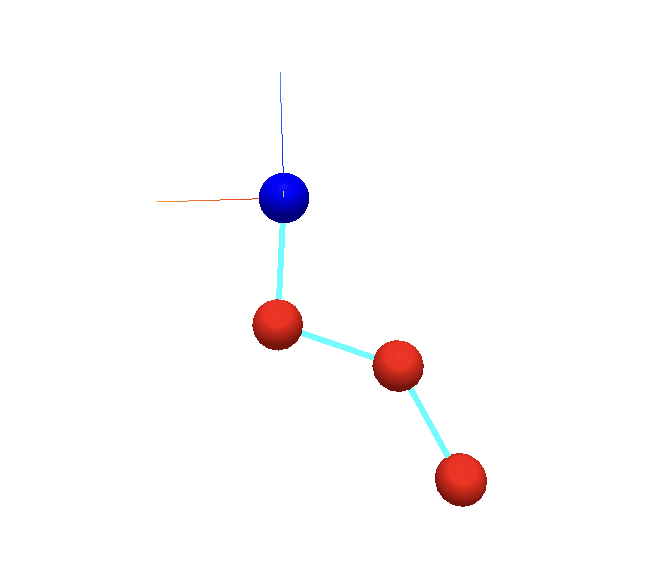

## Exercise 20

To simulate the pendulum mass-spring system, the *Newmark* branch from ASC-ODE was merged into the main branch of this repository. The C++ implementation of the mass spring system can be found in the *mass_spring.hpp* header file in the *mechsystem* folder. This header file allows for the user to configure a arbitrary setup of system with a configurable number of masses, spring connections and fixtures and afterwards describe the system dynamics by differential equations. *mass_spring.cpp* solved a specific system configuration and outputs *test_pendulum* which can be run to obtain the simulation results. *bind_mass_spring.cpp* uses **pybind11** to bind the C++ implementation into a *Python* implementation that can be simulated in either the python file *test_mass_spring.py* or in the *jupyter notebook*, *mass_spring.ipynb* where a 3D simulation of the system can be viewed. For instance, a system consisting of 3 masses, connected in a chain together, with the first mass connected to a fixed point, as shown below in the following python code:

```py
mss = MassSpringSystem3d()
mss.gravity = (0,0,-9.81)

mA = mss.add (Mass(1, (1,0,0)))
mB = mss.add (Mass(2, (2,0,0)))
mC = mss.add (Mass(1, (3,0,0)))
f1 = mss.add (Fix( (0,0,0)) )
mss.add (Spring(1, 200000, (f1, mA)))
mss.add (Spring(1, 100000, (mA, mB)))
mss.add (Spring(1, 200000, (mB, mC)))
```

The 3D visualization is then set up:

```py
masses = []
for m in mss.masses:
    masses.append(
        Mesh(SphereBufferGeometry(0.2, 16, 16),
             MeshStandardMaterial(color='red'),
             position=m.pos)) 

fixes = []
for f in mss.fixes:
    fixes.append(
        Mesh(SphereBufferGeometry(0.2, 32, 16),
             MeshStandardMaterial(color='blue'),
             position=f.pos)) 

springpos = []
for s in mss.springs:
    pA = mss[s.connectors[0]].pos
    pB = mss[s.connectors[1]].pos
    springpos.append ([ pA, pB ] ) 

springgeo = LineSegmentsGeometry(positions=springpos)
m2 = LineMaterial(linewidth=3, color='cyan')
springs = LineSegments2(springgeo, m2)    

axes = AxesHelper(1)
```

And then, after setting the 3D scene, the system can be simulated using the mass spring class member functions/methods, where the differential equations are then solved and visualized:

```py
from time import sleep
for i in range(10000):
    mss.simulate (0.02, 100)
    for m,mvis in zip(mss.masses, masses):
        mvis.position = (m.pos[0], m.pos[1], m.pos[2])

    springpos = []
    for s in mss.springs:
        pA = mss[s.connectors[0]].pos
        pB = mss[s.connectors[1]].pos
        springpos.append ([ pA, pB ]) 
    springs.geometry = LineSegmentsGeometry(positions=springpos)
    sleep(0.01)
```

Using the presented system from above yields a nice 3D simulation when running the jupyter notebook program, *mass_spring.ipynb*:


*Figure X: Simulation of pendulum mass spring system.*

Using the same solvers as for the mass spring system, one could model any other physical system like beam structures, spinning tops, etc. This will however not be covered here.

### Exact differentiation
To ensure that the solver yields a stable solution, the derivative must be exact. An exact derivative of the mass spring system inside of the class *MSS_Function* was implemented:

```cpp
virtual void evaluateDeriv(VectorView<double> x, MatrixView<double> df) const override // exact differentiation
  {
      df = 0.0; // Initialize the derivative matrix to zero

      auto xmat = x.asMatrix(mss.masses().size(), D); // Reshape x into a matrix of size (N x D)
      const size_t N = mss.masses().size(); // Number of masses

      for (auto & spring : mss.springs()) // Loop over each spring
      {
          auto [c1, c2] = spring.connectors; // Get the connectors of the spring

          // Only springs between two masses contribute
          if (c1.type != Connector::MASS || c2.type != Connector::MASS) // Check if both connectors are masses
              continue;

          size_t i = c1.nr; // Index of the first mass
          size_t j = c2.nr; // Index of the second mass

          Vec<D> p1 = xmat.row(i); // Position of the first mass
          Vec<D> p2 = xmat.row(j); // Position of the second mass

          Vec<D> r = p2 - p1; // Vector from mass i to mass j
          double l = norm(r); // Length of the spring
          if (l < 1e-12) continue; // Avoid division by zero

          Vec<D> d = (1.0 / l) * r; // Unit direction vector from mass i to mass j

          double k = spring.stiffness; // Spring stiffness
          double L = spring.length; // Rest length of the spring
          double a = k * (1.0 - L / l); // Coefficient for the identity part
          double b = k * (L / l); // Coefficient for the outer product part

          // Build the D×D stiffness matrix explicitly
          double K[D][D]; // Stiffness matrix
          for (int r1 = 0; r1 < D; ++r1)
              for (int c1 = 0; c1 < D; ++c1)
                  K[r1][c1] = a * (r1 == c1 ? 1.0 : 0.0) + b * d(r1) * d(c1); // K = a*I + b*(d⊗d)

          // divide by masses
          double inv_mi = 1.0 / mss.masses()[i].mass;
          double inv_mj = 1.0 / mss.masses()[j].mass;

          // Fill df manually using the stiffness matrix K
          for (int r1 = 0; r1 < D; ++r1)
          {
              for (int c1 = 0; c1 < D; ++c1)
              {
                  size_t ri = i*D + r1;
                  size_t rj = j*D + r1;
                  size_t ci = i*D + c1;
                  size_t cj = j*D + c1;

                  df(ri, ci) -= K[r1][c1] * inv_mi; // ∂ai/∂pi
                  df(ri, cj) += K[r1][c1] * inv_mi; // ∂ai/∂pj
                  df(rj, ci) += K[r1][c1] * inv_mj; // ∂aj/∂pi
                  df(rj, cj) -= K[r1][c1] * inv_mj; // ∂aj/∂pj
              }
          }
      }
  }
```

Additionally, distance constraints between the masses of the system were added, enforced by usng Lagrange multipliers
### Distance constraints implementation

After adding the distance constraints (enforce by using Lagrange multipliers), the mass-spring system class contains:

* **Masses**: with mass, position, velocity, acceleration
* **Fixes**: fixed points
* **Springs**: linear springs between masses or fixes
* **Distance Constraints**: enforce fixed distance between two masses

* Stored as `DistanceConstraint { size_t i, j; double length; }` in the system.
* In `MSS_Function::evaluate`, after computing normal forces, an **augmented linear system** is built:

```
[ M  J^T ] [a]   = [F]
[ J   0  ] [λ]     [0]
```

where `M` = mass matrix, `J` = constraint Jacobian, `F` = unconstrained forces, `a` = accelerations, `λ` = Lagrange multipliers.

Solving this system ensures accelerations satisfy both Newton's laws and the distance constraints. ODE solvers (Newmark, Euler, etc.) can then integrate the system using these constrained accelerations.
In the *evaluate* function in the **MSS_Funciton** class, the constraints were implemented as follows:

```cpp
// ADDED: distance constraints forces
    const size_t C = mss.constraints().size();
    if (C == 0) return; // nothing to do

    size_t N = mss.masses().size();
    size_t dim = D * N;

    // --- Build Mass Matrix (diagonal) ---
    Matrix<double> M(dim, dim);
    M = 0.0;
    for (size_t i = 0; i < N; ++i)
        for (int d = 0; d < D; ++d)
            M(i*D+d, i*D+d) = mss.masses()[i].mass;

    // --- Build Constraint Jacobian J (C x dimX) ---
    Matrix<double> J(C, dim);
    J = 0.0;
    for (size_t c = 0; c < C; ++c)
    {
        auto & con = mss.constraints()[c];
        Vec<D> diff = xmat.row(con.i) - xmat.row(con.j);
        for (int d = 0; d < D; ++d)
        {
            J(c, con.i*D + d) = 2.0 * diff(d);
            J(c, con.j*D + d) = -2.0 * diff(d);
        }
    }

    // --- Build RHS vector F (unscaled forces) ---
    Vector<> F(dim);
    for (size_t i = 0; i < N; ++i)
        for (int d = 0; d < D; ++d)
            F(i*D + d) = fmat.row(i)(d) * mss.masses()[i].mass;

    // --- Build Augmented System [M J^T; J 0] ---
    Matrix<double> A(dim + C, dim + C);
    A = 0.0;
    Vector<> rhs(dim + C);
    rhs = 0.0;

    // Top-left M
    for (size_t i = 0; i < dim; ++i)
        for (size_t j = 0; j < dim; ++j)
            A(i,j) = M(i,j);

    // Top-right J^T
    for (size_t i = 0; i < dim; ++i)
        for (size_t j = 0; j < C; ++j)
            A(i, dim + j) = J(j,i);

    // Bottom-left J
    for (size_t i = 0; i < C; ++i)
        for (size_t j = 0; j < dim; ++j)
            A(dim + i, j) = J(i,j);

    // RHS
    for (size_t i = 0; i < dim; ++i) rhs(i) = F(i);
    for (size_t i = 0; i < C; ++i) rhs(dim + i) = 0.0;

      // --- Solve the system (dense LU, simple version) ---
    Vector<> sol(dim + C);
    sol = rhs; // initialize solution

    // Forward elimination
    for (size_t k = 0; k < dim + C; ++k)
    {
        if (std::abs(A(k,k)) < 1e-12)
            throw std::runtime_error("Zero pivot in LU solve");

        for (size_t i = k+1; i < dim + C; ++i)
        {
            double factor = A(i,k)/A(k,k);
            A(i,k) = factor; // store L
            for (size_t j = k+1; j < dim + C; ++j)
                A(i,j) -= factor*A(k,j);
            sol(i) -= factor*sol(k);
        }
    }

    // Back substitution
    for (int i = int(dim + C) - 1; i >= 0; --i)
    {
        for (size_t j = i+1; j < dim + C; ++j)
            sol(i) -= A(i,j)*sol(j);
        sol(i) /= A(i,i);
    }
    

    // --- Write accelerations back to fmat ---
    for (size_t i = 0; i < N; ++i)
        for (int d = 0; d < D; ++d)
            fmat.row(i)(d) = sol(i*D + d);
```

 

