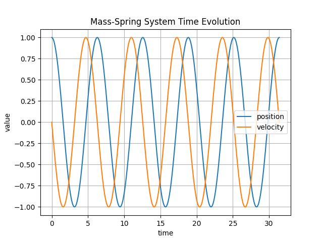
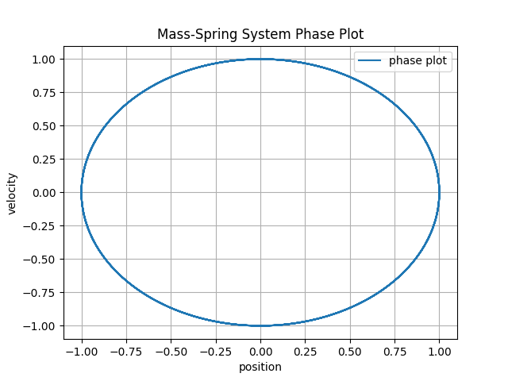
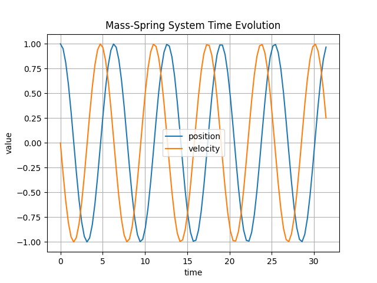
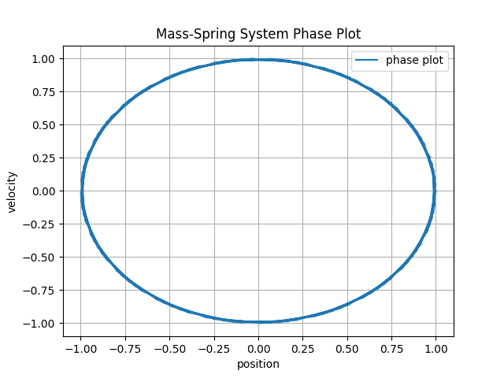
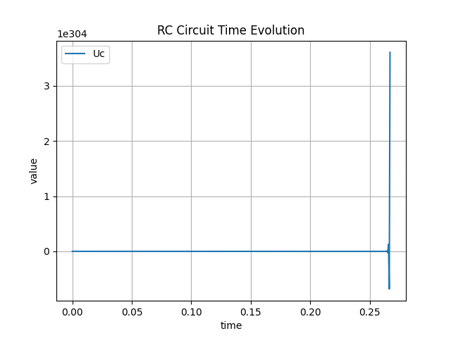
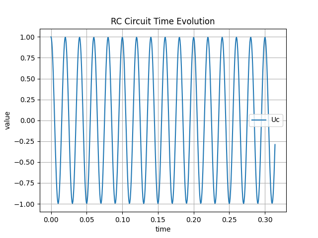
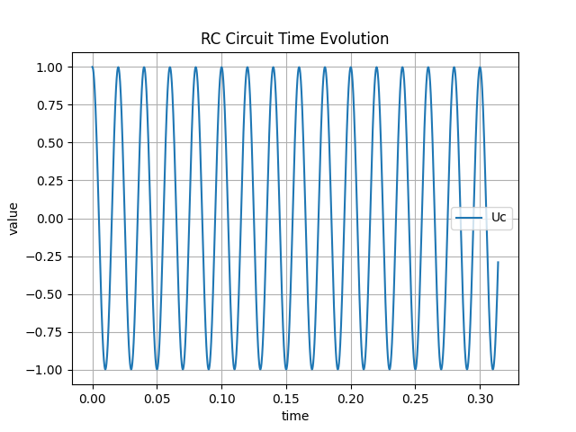
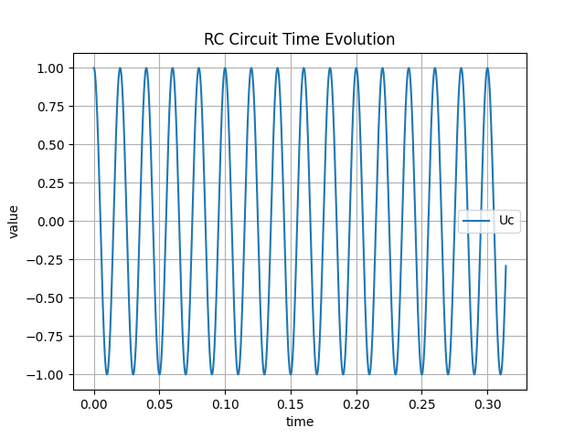

# Welcome to ASC-ODE's documentation!


ASC-ODE is is a C++ library for solving ordinary differential equations (ODEs).
The equation is defined by the right hand side function.
ASC-ODE provides various time-steppers which may be used for odes with right hand sides
given by a function object.

## Installation (TBD)

install XXX-odesolver it via git-clone:

    git clone https://github.com/my-github-clone/my-ode-solver.git


To configure and build some tests do

    cd my-ode-solver
    mkdir build
    cd build
    cmake ..
    make

## Mass spring system

A small demo for solving a mass-spring model as first order ODE
$ \begin{matrix}
y_0^\prime & = & y_1 \\
y_1^\prime & = & -\frac{k}{m} y_0
\end{matrix} $
is here:

```cpp
double tend = 4*M_PI;
int steps = 100;
double tau = tend/steps;

Vector<> y = { 1, 0 };  // initial conditions
shared_ptr<NonlinearFunction> rhs = std::make_shared<MassSpring>(mass, stiffness);

// Choose from three stepper methods below:
ExplicitEuler stepper(rhs);
// ImplicitEuler stepper(rhs);
// ImprovedEuler stepper(rhs);
// CrankNicolson stepper(rhs);

std::cout << 0.0 << "  " << y(0) << " " << y(1) << std::endl;
for (int i = 0; i < steps; i++)
  {
     stepper.DoStep(tau, y);
     std::cout << (i+1) * tau << "  " << y(0) << " " << y(1) << std::endl;
  }
```    

#### Exercise 17.2.2

The result of this simulation in time and phase space is shown below, where a comparison between the three stepper methods, the explicit Euler, the implicit Euler, and the improved Euler method, has been made:


<p align="center">
  
  <br>
  <em>Figure 1: Explicit Euler with 1000 steps simulation</em>
</p>
<p align="center">
  
  <br>
  <em>Figure 2: Explicit Euler with 1000 steps phase diagram</em>
</p>
<p align="center">
  
  <br>
  <em>Figure 3: Implicit Euler with 1000 steps simulation</em>
</p>
<p align="center">
  
  <br>
  <em>Figure 4: Implicit Euler with 1000 steps phase diagram</em>
</p>
<p align="center">
  
  <br>
  <em>Figure 5: Improved Euler with 1000 steps simulation</em>
</p>
<p align="center">
  
  <br>
  <em>Figure 6: Improved Euler with 1000 steps phase diagram</em>
</p>

As the spring mass model does not include any damping, it is expected that the system performs a harmonic oscillation. It was found that if the number of steps was chosen too low for either the explicit Euler or the implicit Euler method, the solution would diverge and either be unstable or yield a damped system. Increasing the number of steps fixed this issue. The improved Euler method was far more robust and could handle lower step numbers and still yield a correct response.
Below, a plot of the explicit Euler method can be seen with a step number of 10000, which ensures that the solution converges to a harmonic oscillation:

<p align="center">
  
  <br>
  <em>Figure 7: Explicit Euler with 100000 steps simulation</em>
</p>
<p align="center">
  
  <br>
  <em>Figure 8: Explicit Euler with 100000 steps phase diagram</em>
</p>

Increasing the end time for the simulations results in the implicit or explicit methods diverging from the desired result (harmonic oscillation) even further. When the step number is increased dramatically, this effect is reduced.

#### Exercise 17.4.1
    
In exercise 17.4.1, the Crank-Nicolson method for time stepping is also implemented.

$$y_{i+1} = y_i + \frac{\tau}{2}(f(t_i, y_i) + f(t_{i+1}, y_{i+1})), \quad 0 \le i < n$$
The C++ implementation can be seen below in the section **Available time-stepping methods**.
When using the Crank-Nicolson method on the spring mass system it becomes evident that it converges much faster than the explicit and implicit Euler methods and requires a significantly smaller number of steps. Below, a simulation of the mass spring system using the Crank-Nicolson method with only 100 steps is shown. The method is robust and converges very fast.

<p align="center">
  
  <br>
  <em>Figure 9: Crank-Nicolson with 100 steps simulation</em>
</p>
<p align="center">
  
  <br>
  <em>Figure 10: Crank-Nicolson with 100 steps phase diagram</em>
</p>

**RC Circuit implementation**

The RC circuit is modelled as:
$$\frac{dU_C}{dt} = \frac{U_0 - U_C}{RC}$$

as the rhs of the equation depends on time $t$, as $U_0 = cos(\omega t)$, where $\omega = 100\pi$, this is not a *autonomous* ODE. It can be made autonomous by adding time $t$ as a state $x_2$, where $x_1$ is $U_C$. The RC circuit is implemented in C++:

```cpp
class RCCircuit : public NonlinearFunction
{
private:
  double resistance;
  double capacitance;
  double omega;

public:
  RCCircuit(double R, double C, double w) : resistance(R), capacitance(C), omega(w) {}

  size_t dimX() const override { return 2; } // make autonomous by adding time as a variable
  size_t dimF() const override { return 2; }

  void evaluate (VectorView<double> x, VectorView<double> f) const override
  {
    f(0) = (cos(omega * x(1)) - x(0)) / (resistance * capacitance); // dUc/dt
    f(1) = 1.0; // dt/dt = 1
  }
  void evaluateDeriv (VectorView<double> x, MatrixView<double> df) const override
  {
    df = 0.0; // reset
    df(0,0) = -1.0 / (resistance * capacitance); // d(dUc/dt)/d(Uc)
    df(0,1) = -omega * sin(omega * x(1)) / (resistance * capacitance); // d(dUc/dt)/d(t)
    df(1,1) = 0.0; // d(dt/dt)/d(t)
  }
};
```

The RC Circuit ODE is solved numerically with the three methods, explicit Euler, implicit Euler and Crank-Nicolson, at time steps 500 and 2000, for a total time of $t_{end} = 0.1\pi$:

<p align="center">
  
  <br>
  <em>Figure 11: RC ODE: Explicit Euler with 500 steps simulation</em>
</p>
<p align="center">
  
  <br>
  <em>Figure 12: RC ODE: Implicit Euler with 500 steps simulation</em>
</p>
<p align="center">
  
  <br>
  <em>Figure 13: RC ODE: Crank-Nicolson with 500 steps simulation</em>
</p>
<p align="center">
  
  <br>
  <em>Figure 14: RC ODE: Explicit Euler with 2000 steps simulation</em>
</p>
<p align="center">
  
  <br>
  <em>Figure 15: RC ODE: Implicit Euler with 2000 steps simulation</em>
</p>
<p align="center">
  
  <br>
  <em>Figure 16: RC ODE: Crank-Nicolson with 2000 steps simulation</em>
</p>

As evident from the i simulations below, the explicit Euler is unstable for low step numbers and needs a significantly higher step number to converge.
Implicit Euler and Crank-Nicolson are both stable at low step numbers and exert stable behaviour.


## Available time-stepping methods


#### Explicit Euler
```cpp
class ExplicitEuler : public TimeStepper
  {
    Vector<> m_vecf;
  public:
    ExplicitEuler(std::shared_ptr<NonlinearFunction> rhs) 
    : TimeStepper(rhs), m_vecf(rhs->dimF()) {}
    void DoStep(double tau, VectorView<double> y) override
    {
      this->m_rhs->evaluate(y, m_vecf);
      y += tau * m_vecf;
    }
  };
```

#### Implicit Euler
```cpp
class ImplicitEuler : public TimeStepper
  {
    std::shared_ptr<NonlinearFunction> m_equ;
    std::shared_ptr<Parameter> m_tau;
    std::shared_ptr<ConstantFunction> m_yold;
  public:
    ImplicitEuler(std::shared_ptr<NonlinearFunction> rhs) 
    : TimeStepper(rhs), m_tau(std::make_shared<Parameter>(0.0)) 
    {
      m_yold = std::make_shared<ConstantFunction>(rhs->dimX());
      auto ynew = std::make_shared<IdentityFunction>(rhs->dimX());
      m_equ = ynew - m_yold - m_tau * m_rhs;
    }

    void DoStep(double tau, VectorView<double> y) override
    {
      m_yold->set(y);
      m_tau->set(tau);
      NewtonSolver(m_equ, y);
    }
  };
```

#### Improved Euler:
```cpp
  class ImprovedEuler : public TimeStepper // improved Euler method
  {
    Vector<> m_vecf; // f evaluated at current step
    Vector<> m_ytilde; // intermediate value
  public:
    ImprovedEuler(std::shared_ptr<NonlinearFunction> rhs) 
    : TimeStepper(rhs), m_vecf(rhs->dimF()), m_ytilde(rhs->dimX()) {} // constructor
    void DoStep(double tau, VectorView<double> y) override // perform one time step
    {
      this->m_rhs->evaluate(y, m_vecf); // evaluate f(y_n)
      m_ytilde = y + (tau/2.0) * m_vecf; // compute y_tilde
      this->m_rhs->evaluate(m_ytilde, m_vecf); // evaluate f(y_tilde)
      y += tau * m_vecf; // update y to y_{n+1}
    }
  };  
```

#### Crank-Nicolson:
```cpp
class CrankNicolson : public TimeStepper
  {
    std::shared_ptr<NonlinearFunction> m_equ; // nonlinear equation to solve
    std::shared_ptr<Parameter> m_tau; // time step size parameter
    std::shared_ptr<ConstantFunction> m_yold; // previous time step value
    std::shared_ptr<ConstantFunction> m_fold; // f evaluated at previous step
  public:
    CrankNicolson(std::shared_ptr<NonlinearFunction> rhs) // constructor
    : TimeStepper(rhs), m_tau(std::make_shared<Parameter>(0.0))  // initialize time step size parameter
    {
      m_yold = std::make_shared<ConstantFunction>(rhs->dimX()); // previous time step value initialized as constant function
      auto ynew = std::make_shared<IdentityFunction>(rhs->dimX()); // current time step value initialized as identity
      m_fold = std::make_shared<ConstantFunction>(rhs->dimF()); // f evaluated at previous step initialized as constant function
      m_equ = ynew - m_yold - m_tau * (m_rhs + m_fold); // crank-nicolson equation
    }

    void DoStep(double tau, VectorView<double> y) override
    {
      m_yold->set(y); // set yold to previous y value
      this->m_rhs->evaluate(y, m_fold->get()); // evaluate f at previous y value
      m_tau->set(tau/2.0); // set time step size parameter to tau/2
      NewtonSolver(m_equ, y); // set y to solution of nonlinear equation
    }
  };
```


   
